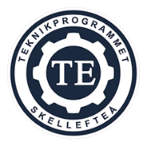

**Johan Andersson**  
  
Gymnasiearbete 100 p  
Teknikprogrammet 23/24  
Baldergymnasiet  
Handledare: Mattias Vinevall

# Spear guy - ett plattformsspel i Godot

## Sammanfattning
### syfte 
Jag (Johan) ska skapa ett spel tillsammans med Vide. 

## Abstract
## Innehållsförteckning
## 1. Inledning

### 1.1 Syfte och Avgränsningar
Jag är intresserad av programmering och att skapa ett spel är en intressant utmaning. 

Jag trodde att det skulle vara utmanade att se till att spelaren kändes bra att kontrollera och att hålla fysikmotorn i schack. 

vad jag trodde skulle bli problem:
- fysikmotor
- spelarkontroller
verkliga problem: 
- git merge conflicts
- filstrukturer (eller avsaknaden av)
- olika visioner
### 1.2 frågor mål
Är det rimligt att göra ett spel i en obekant spelmotor och kodsynkningsprogram under 100 timmar?
Hur ser det ut att göra ett spel i Godot?
Vilka utmaningar kommer jag möta under programmeringens gång?

Mitt mål är skapa ett fungerande spel i Godot och lägga upp det på [itch](https://mr-carrot0.itch.io/spear-guy-alfa). 

### 1.3 Metod / källor
### 1.4 Bakgrund

## 2. Resultat

### 2.1 Underrubrik  
Här görs en sakligt beskrivning av hur arbetet fortlöpt. Det kan vara att beskriva olika arbetsmoment såsom t ex skisser, tester, ritningar eller montage. Det kan också vara  att redovisa resultat från kunskapsinhämtning från olika källor, t ex  från litteratur, atriklar, praktiska försök, enkäter, Youtube-kanaler m m.

### 2.2 Underrubrik  
För att göra det tydligt och överskådligt struktureras resultatet upp i flera underrubriker så det blir lättläst och begripligt.

## 3. Diskussion
**3.1 Underrubrik  
Här ska du resonera om ditt resultat. Varför blev det som det blev? Nåddes målen? Fick frågeställningarna svar? Lärdomar?  
(Ingen ny information om projektet får ges här).

## Källförteckning  
**Här sorteras och listas dina källor. Kolla upp hur du ska göra.

## Figur- och tabellförteckning
**Här sorteras och listas dina figurer(bilder) och tabeller

/**
## genomförande / metod  
Vi kommer använda oss spelmotorn Godot i kombination med Git/Github för att kunna samarbeta på ett bra och smidigt sätt. 

## tidsplan / aktiviteter

## dokumentation 

## redovisning / presentation
Det spännande och utmanande att skapa ett spel, och dessutom lärde jag mig en hel del om spelutveckling, dess tekniker, organisering och samarbete. Jag har fått en djupare förståelse över hur spel går från koncept till produkt och problemen som kan uppstå däremellan. 

Jag har lärt mig att programmera i gdscript, sätta upp scener och noder i Godot och hur flera personer kan samarbeta på ett projekt med Git. 